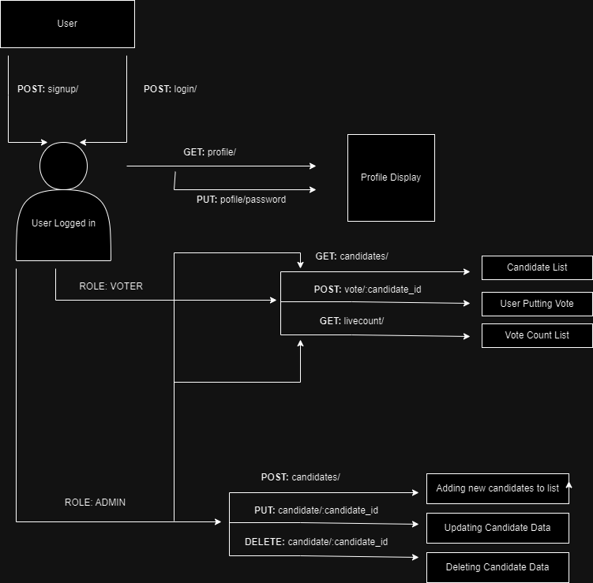

# Introduction

VoteOnCloud is a backend application for a voting system that enables users to cast their votes for candidates. It includes features for user authentication, candidate management, and the voting process.
# Installation

To run this project on your local environment, you need to fork and copy the repo to your local environment first

- Then get inside the project folder in your local environment
```bash
  cd VoteOnCloud
```

- Then created an .env file and setup MongoDB Address and then install node modules

```bash
  npm i
```
- Then run the node server

```bash
  nodemon server.js
```
# Functionalities

- User Registration and Login: Users can sign up and log in using their Aadhaar Card Number and a password.
- View List of Candidates: Users can view the list of candidates.
- Vote for a Candidate: Users can vote for a candidate, with each user being allowed to vote only once.
- Admin Functions: 
  - Manage Candidates: Admins can add, update, and delete candidates from the list.
  - Voting Restrictions: Admins cannot vote in the election.


## Demo

A diagram of the whole backend route flow and working.

